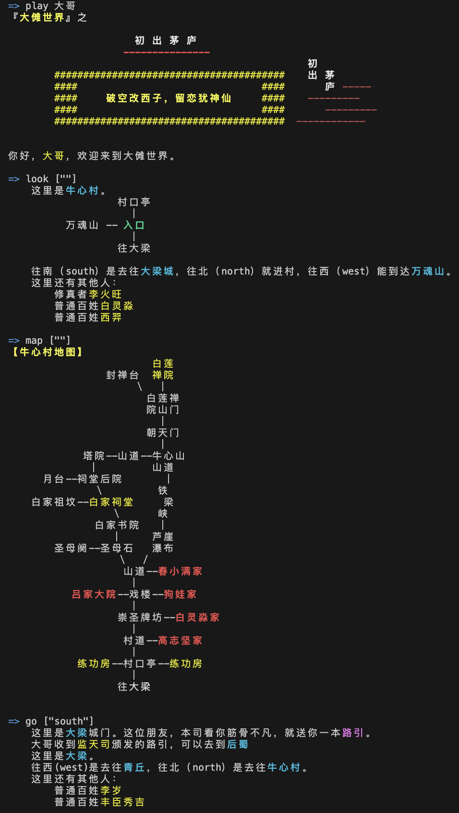

<h1 align='center'>太乙（Taiyi）</h1>

<br>
<div align='center'>
  <a href='https://hub.docker.com/r/hongzhongx/taiyi/tags'></a>
  <a href='https://github.com/hongzhongx/taiyi/blob/main/LICENSE'></a>
  <a href='https://github.com/hongzhongx/taiyi/graphs/contributors'></a>
  <a href='https://github.com/hongzhongx/taiyi/commits/main'></a>
</div>
<p align="center">
👋 项目才开始，初期请到<a href="https://discord.gg/g4f84UEGCD" target="_blank">Discord</a>交流
</p>
<br>

# 介绍

这是一个在线虚拟小游戏，模拟一个修仙世界，为乐子人找找乐子。

<br>
<div align='center'><a href='./doc/imgs/map.png'></a></div>
<div align='center'><i>在Mud游戏中，如果你能真正拥有并设计自己的房间，又或者能运营自己的城镇门派，会是一种什么体验？</i></div>

## 模拟游戏世界的基础网络——太乙（Taiyi）

司命们相互连接，逐渐形成一个因果网络，上面运转各种天道规则，在这些规则下，演化众多虚拟的世界。其中之一，就是大傩世界。

无论你是开发者、运营者、玩家还是NPC、真人还是AI Agent，只要你接入太乙网络，你就是在玩这个游戏，任何接入者都有资格平等地建设上面的虚拟世界并且和它交互。不仅如此，各种规则（天道）也随着游戏进行而逐渐创建完善并不断演化，这些规则也可以由任何接入者来开发。

开发和维持这个游戏网络，可以由任何匿名接入者完成，不需要中心化设施。玩家们能在互不了解和信任的情况下，组织游戏设计和开发，并公平地获得奖励。

大傩世界游戏使用了区块链思想和技术，游戏不是建立在抽象的通用区块链上，游戏本身包含了区块链。

## 文档

### 世界观和文化背景

* 太乙宇宙观：原本见[《太乙宇宙内篇》](./doc/yuzhou.md)，现代白话解读见[《太乙宇宙多维结构——五部十八界》](./doc/yuzhou_explain.md)，其中阐述了太乙第一定律——太乙因果律
* 真气守恒定律：也称太乙第二定律，详见[《先天真炁守恒论》](./doc/zhenqishouheng.md)
* 演化概论I：阐述了太乙宇宙中各种生灵之间的演化，详见[《太乙宇宙演化概论I》](./doc/yanhua_explain.md)
* 演化概论II：阐述了太乙宇宙中修真体系的演化，详见[《太乙宇宙演化概论II》](./doc/kejixiuzhen_explain.md)

### 技术和工具

* 太乙改进建议集（Taiyi Improvement Proposals——TIPs）：<https://github.com/hongzhongx/TIPs>
* 建设实践：大傩建设和实践报告，详见[https://github.com/hongzhongx/taiyi-contracts](https://github.com/hongzhongx/taiyi-contracts)
* 智能游戏脚本（SGS）：[https://github.com/hongzhongx/taiyi-contracts/blob/main/doc/sgs-whitepaper.pdf](https://github.com/hongzhongx/taiyi-contracts/blob/main/doc/sgs-whitepaper.pdf) (*暂缺*)

### 沟通和交流

* 前期交流社区（Discord）：[https://discord.gg/g4f84UEGCD](https://discord.gg/g4f84UEGCD)。理想情况下，社区将由太乙网络本身承载，详见[坐忘道项目](https://)
* 几个相关项目的Github论坛：在[TIPs论坛](https://github.com/hongzhongx/TIPs/discussions)、[太乙网络项目论坛](https://github.com/hongzhongx/taiyi/discussions/)和[合约应用实践论坛](https://github.com/hongzhongx/taiyi-contracts/discussions)中打开一个主题贴来讨论各种改进建议

### 白皮书

* 白皮书？番茄小说网上搜索一部名叫《大傩世界》的小说，正在免费连载。

## 特色

* 游戏交互无需费用（可恢复的行动力 = 免费模式）
* 快速事件确认（一息=3秒钟）
* 延时安全性（气/QI = 延时转换的阳寿/YANG）
* 分层权限（多级私钥）
* 原生实现的内置游戏资产分配
* 天道：智能游戏脚本（Smart Game Scripts）
* 持续丰富的游戏内容用户创建（天道的运行，化生阳寿或者气的激励）

## 为什么用Lua作为智能游戏脚本的虚拟机？而不是EVM、WASM、V8或者Docker等等

* 实现的司命网络中使用了区块链技术，并且原生实现了游戏的基本逻辑和资产。记住太乙网络本身属于游戏的一部分，她已经部署了原生的游戏资产，用户不需要再使用智能合约来为游戏资产定义。太乙网络上的智能合约就是智能游戏脚本（SGS），被用于游戏应用本身的逻辑和配置，而非为通用应用开发，这点很像早期的MUD游戏编程语言。
* Lua本身非常轻量级，而且能很好地和C++应用集成。欢迎所有用过Lua开发游戏的程序员们！
* 我们需要的是一种配置型的智能合约，而不是通用智能合约。我们要方便地在这种区块链式的网络上配置大傩世界游戏的资源和逻辑，而不是要搞各种各样的区块链应用。 一句话，太乙网络本身就是一个游戏，只不过使用了加密区块链技术。
* 更多关于太乙Lua虚拟机的信息，请参阅[文档](libraries/lua/README.md)

## 一些指标细节

* 基本通货是阳寿丹，简称阳寿，符号是YANG
* 司命因果网络的共识机制采用了代理权益证明（DPOS）算法，司命的实力需要信众的力量
* 全网阳寿供应持续进行通货膨胀，在现实时间二十年内，通货膨胀率从10%年化率（APR）线性降低到1%年化率（APR）
  * 90%的新增供应用于奖励游戏逻辑开发、游戏内容的生产和运作（大部分以真气形式奖励）
  * 10%的新增供应用于奖励维护天道因果网络的司命们（即区块生产节点）
* 大傩世界的一天，持续时长约为现实时间1小时，即现实一年，大傩二十四年

# 路线图/计划

详见[太乙网络路线和计划](doc/roadmap.md)

# 安装说明

接入太乙网络还算简单，你要么直接选择 Docker 镜像，要么手动编译 Docker 环境，或者直接从源代码编译。所有步骤都有适合不同操作系统的文档说明，其中最简单的方式建议使用 Ubuntu 22.04

## 如何快速开始

如果想快速接入太乙网络，这里提供了方便的预编译好的Docker镜像。更多说明请参阅[快速启动指南](doc/quickstart.md)。

## 编译项目

**强烈**建议使用这里提供的预编译 Docker镜像或者使用Docker来编译太乙系统，这些过程都在[快速启动指南](doc/quickstart.md)中有说明。

但是假如你需要从源代码编译系统，这里也有一个[编译说明](doc/building.md)来讲解在 Linux (Ubuntu LTS) 和 MacOS 操作系统下的方法。

## 通过Docker启动点对点节点（P2P Node）

启动一个P2P节点（目前需要2GB内存）：

    docker run \
        -d -p 2025:2025 -p 8090:8090 --name taiyin-default \
        zuowangdaox/taiyi

    docker logs -f taiyin-default  # follow along

## 通过Docker启动全节点（Full Node）

启动一个提供*所有*可查询数据的节点（例如用来支撑一个内容网站前端，目前需要14GB的内存，这个内存量在不断增长中）：

    docker run \
        --env USE_WAY_TOO_MUCH_RAM=1 --env USE_FULL_WEB_NODE=1 \
        -d -p 2025:2025 -p 8090:8090 --name taiyin-full \
        zuowangdaox/taiyi

    docker logs -f taiyin-full

## 通过Docker启动测试网的全节点（Full Node）

启动一个提供*所有*可查询数据的测试网络节点（例如用来支撑一个内容网站前端，目前需要4GB的内存，这个内存量在不断增长中）：

    docker run \
        --env IS_TESTNET=1 --env USE_FULL_WEB_NODE=1 \
        --env REQUIRED_PARTICIPATION=0 --env TAIYI_SEED_NODES="47.109.49.30:2025" \
        -d -p 2025:2025 -p 8090:8090 --name taiyin-full \
        zuowangdaox/taiyi

    docker logs -f taiyin-full

## 使用玄牝之门（xuanpin）

为了和节点服务程序`太阴（taiyin）`交互，这里提供了一个基础的客户端程序，叫做`玄牝（xuanpin）`。这个客户端程序自带文档，可以通过help命令查看。玄牝所连接到的节点，必须启用了`account_by_key_api`和`baiyujing_api`两个插件，而且是通过`webserver-ws-endpoint`参数配置了能接受WebSocket连接的。

## 测试

要构建测试项目，请参考文档[doc/devs/testing.md](doc/devs/testing.md)，关于测试用例的一些说明可以参考[tests/README.md](./tests/README.md)。

# 配置太乙节点

## 配置文件说明

首次启动程序`taiyin`可以自动生成默认的数据目录和配置文件，这些文件默认存放在目录`siming_node_data_dir`中。由于默认配置下没有指明任何种子节点，太阴程序什么都不会做，因此你只能强行关闭（杀掉）`taiyin`进程。如果你要修改配置，这里有两个用于Docker镜像的配置示例可供参考（ [共识节点](contrib/config-for-docker.ini)和[全节点](contrib/fullnode.config.ini) ）。默认的配置包含了所有的选项，一些选项会根据Docker的配置来改变（一些镜像中使用的选项可以由命令行来设置）。

## 种子节点

这里有个列表列出了一些种子节点，你可以用这些节点来开始加入网络。
[doc/seednodes.txt](doc/seednodes.txt).

这个文件已经被打包到了Docker的镜像中。在启动`doker run`时，容器环境变量`TAIYI_SEED_NODES`可以以空白分割的种子节点（包括端口号）信息来覆盖设置这个。

## 环境变量

这里有一些环境变量设置，使得以不同方式运行太乙节点：

* `USE_WAY_TOO_MUCH_RAM` - 如果设置为true，太乙系统将启动一个‘全节点’
* `USE_FULL_WEB_NODE` - 如果设置为true，默认配置文件将打开完全API访问选项和启动一些相关的插件。
* `USE_NGINX_FRONTEND` - 如果设置为true，将在太乙节点外层启用一个NGINX反向代理，这个代理会先处理接收到的WebSocket太乙请求。这也会启动一个自定义的健康检查，在路径'/health'下将列出你的节点离当前网络最新的块还差多长时间。如果离同步最新的块差距在60秒钟以内，这个健康检查会返回'200'代码。
* `USE_MULTICORE_READONLY` - 如果设置为true，太乙系统将会启动多人读取模式，这在多核系统上能提供更好性能。所有的读取请求将被多个只读节点处理，而所有写请求被自动转发到一个单一的‘写’节点。NGINX对只读节点请求进行负载均衡处理，每个CPU核平均处理4个请求。目前这个设计还处在实验阶段，在某些API调用的情况下还有问题，这些问题有待未来的开发来解决。
* `HOME` - 设置你要太乙系统存储数据文件的路径（包括块数据、状态数据和配置文件等等）。默认情况下，这个路径是`/var/lib/taiyi`，这个路径在docker容器中也要存在。如果需要使用另外的载入位置（比如内存磁盘，或者另外一个磁盘驱动器），你可以设置这个变量来指向你的docker容器上的映射卷。
* `IS_TESTNET` - 如果设置为true，则使用适配当前测试网络的节点程序。
* `REQUIRED_PARTICIPATION` - 节点参与率，在某些测试网络环境下，节点的参与率并不高，因此在测试网络环境下可以设置为0。

## 系统需求说明

对于一个全功能的Web用太乙节点，目前需要至少110GB的磁盘空间，而区块数据本身只占27GB多。强烈建议在一个快速磁盘系统上运行太乙系统，比如SSD硬盘或者干脆将状态文件放进内存磁盘，在命令行上可以使用`--state-storage-dir=/path`选项来设置这些位置。对一个全功能Web服务型节点，其状态数据至少有16GB大，一个种子节点（p2p模式）一般消耗低至4G的内存和24GB的状态数据文件空间，基本上当前的单核CPU都能满足性能要求。注意太乙系统一直在持续增长中，以上数字只是我假想的截止到2025年11月的实测，然而你可能会发现运行全节点一般都需要更多的磁盘空间。未来我们会持续不断地优化太乙系统使用的磁盘空间。

在Linux系统上，初始同步或者重演（replay）太乙节点可以使用如下的虚拟内存（Virtual Memory）设置。当然，通常情况下是不需要这样做的。

```
echo    75 | sudo tee /proc/sys/vm/dirty_background_ratio
echo  1000 | sudo tee /proc/sys/vm/dirty_expire_centisecs
echo    80 | sudo tee /proc/sys/vm/dirty_ratio
echo 30000 | sudo tee /proc/sys/vm/dirty_writeback_centisecs
```

# 责任和权益

大傩世界游戏没有项目方，该游戏网络（即太乙网络）由坐忘道🀄️发起，纯粹为了乐子人找乐子，任何爱好者都可以自由参与、分发或者离开，本项目造成一切后果均由坐忘道负责。

本项目的代码全部开源，坐忘道🀄️放弃一切权益，不承担任何责任，不承诺提供任何支持。

<br>
<div align='center'><b><big><i>听到天外的号角，揭开你修仙的帷幕</i></big></b></div>
