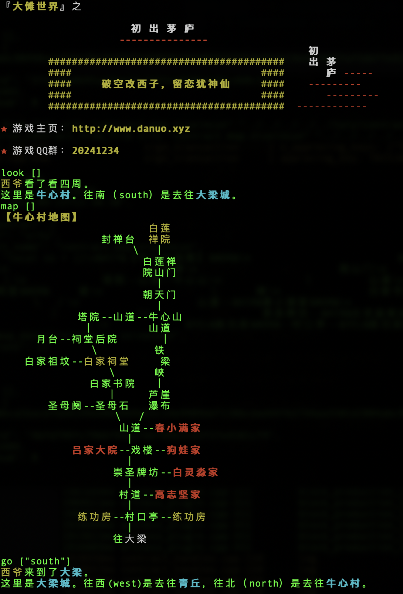
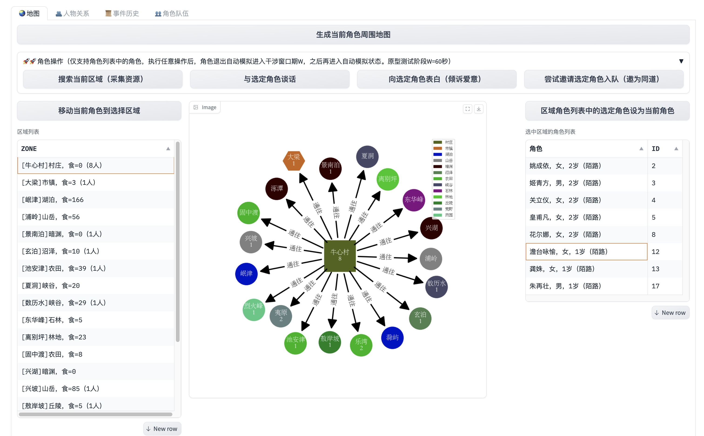
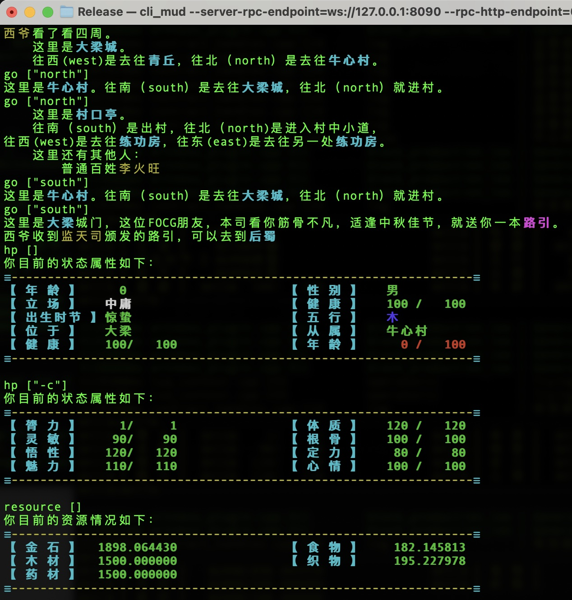

<h1 align='center'>太乙（Taiyi）</h1>

<br>
<div align='center'>
    <a href='https://hub.docker.com/r/hongzhongx/taiyi/tags'></a>
    <a href='https://github.com/hongzhongx/taiyi/blob/main/LICENSE'></a>
    <a href='https://github.com/hongzhongx/taiyi/graphs/contributors'></a>
    <a href='https://github.com/hongzhongx/taiyi/commits/main'></a>
</div>
<p align="center">
👋 项目才开始，初期请到<a href="https://discord.gg/g4f84UEGCD" target="_blank">Discord</a>交流
</p>
<br>

# 介绍

这是一个在线虚拟小游戏，模拟一个修仙世界，为乐子人找找乐子。

<br>
<div align='center'><a href='./doc/imgs/map.jpg'></a></div>
<div align='center'><i>在Mud游戏中，如果你能真正拥有并设计自己的房间，又或者能运营自己的城镇门派，会是一种什么体验？</i></div>


## 模拟游戏世界的基础网络——太乙（Taiyi）

司命们相互连接，逐渐形成一个因果网络，上面运转各种天道规则，在这些规则下，演化众多虚拟的世界。其中之一，就是大傩世界。

无论你是开发者、运营者、玩家还是NPC、真人还是AI Agent，只要你接入太乙网络，你就是在玩这个游戏，任何接入者都有资格平等地建设上面的虚拟世界并且和它交互。不仅如此，各种规则（天道）也随着游戏进行而逐渐创建完善并不断演化，这些规则也可以由任何接入者来开发。

开发和维持这个游戏网络，可以由任何匿名接入者完成，不需要中心化设施。玩家们能在互不了解和信任的情况下，组织游戏设计和开发，并公平地获得奖励。

大傩世界游戏使用了区块链思想和技术，游戏不是建立在抽象的通用区块链上，游戏本身包含了区块链。

## 文档

* 太乙宇宙观：原本见[《太乙宇宙内篇》](./doc/yuzhou.md)，现代白话解读见[《太乙宇宙多维结构——五部十八界》](./doc/yuzhou_explain.md)，其中阐述了太乙第一定律——太乙因果律
* 真气守恒定律：也称太乙第二定律，详见[《先天真炁守恒论》](./doc/zhenqishouheng.md)
* 建设实践：大傩建设和实践报告，详见[https://github.com/hongzhongx/taiyi-contracts](https://github.com/hongzhongx/taiyi-contracts)
* 智能游戏脚本（SGS）：[https://github.com/hongzhongx/taiyi-contracts/blob/main/doc/sgs-whitepaper.pdf](https://github.com/hongzhongx/taiyi-contracts/blob/main/doc/sgs-whitepaper.pdf) (*不断更新中*)
* 前期交流社区（Discord）：[https://discord.gg/g4f84UEGCD](https://discord.gg/g4f84UEGCD)。理想情况下，社区将由太乙网络本身承载，详见[坐忘道项目](https://)

## 特色

* 游戏交互无需费用（可恢复的行动力 = 免费模式）
* 快速事件确认（一息=3秒钟）
* 延时安全性（气/QI = 延时转换的阳寿/YANG）
* 分层权限（多级私钥）
* 原生实现的内置游戏资产分配
* 天道：智能游戏脚本（Smart Game Scripts）
* 持续丰富的游戏内容用户创建（天道的运行，化生阳寿或者气的激励）

## 为什么用Lua作为智能游戏脚本的虚拟机？而不是EVM、WASM、V8或者Docker等等

* 实现的司命网络中使用了区块链技术，并且原生实现了游戏的基本逻辑和资产。记住太乙网络本身属于游戏的一部分，她已经部署了原生的游戏资产，用户不需要再使用智能合约来为游戏资产定义。太乙网络上的智能合约就是智能游戏脚本（SGS），被用于游戏应用本身的逻辑和配置，而非为通用应用开发，这点很像早期的MUD游戏编程语言。
* Lua本身非常轻量级，而且能很好地和C++应用集成。欢迎所有用过Lua开发游戏的程序员们！
* 我们需要的是一种配置型的智能合约，而不是通用智能合约。我们要方便地在这种区块链式的网络上配置大傩世界游戏的资源和逻辑，而不是要搞各种各样的区块链应用。 一句话，太乙网络本身就是一个游戏，只不过使用了加密区块链技术。
* 更多关于太乙Lua虚拟机的信息，请参阅[文档](libraries/lua/README.md)

## 一些指标细节

* 基本通货是阳寿丹，简称阳寿，符号是YANG
* 司命因果网络的共识机制采用了代理权益证明（DPOS）算法，司命的实力需要信众的力量
* 全网阳寿供应持续进行通货膨胀，在现实时间二十年内，通货膨胀率从10%年化率（APR）线性降低到1%年化率（APR）
    * 90%的新增供应用于奖励游戏逻辑开发、游戏内容的生产和运作（大部分以真气形式奖励）
    * 10%的新增供应用于奖励维护天道因果网络的司命们（即区块生产节点）
* 大傩世界的一个月，持续时长约为现实时间2小时，即现实一天，大傩一年

# 路线图/计划

## 第一部分[【起源】](https://github.com/hongzhongx/taiyi/blob/main/doc/yuzhou_explain.md#%E6%BA%90%E9%83%A8%E8%B5%B7%E6%BA%90)

本阶段用于启动最初的因果天道运行，各种最初的法宝开始运转，最初的物质体系形成。这个阶段需要对太乙宇宙[“起源”](https://github.com/hongzhongx/taiyi/blob/main/doc/yuzhou_explain.md#%E6%BA%90%E9%83%A8%E8%B5%B7%E6%BA%90)部分理论有所理解的参与者。

账号在这个阶段可以开始炼制法宝，并通过法宝执行各种操作。

包含如下四个计划：

- [x] [【司命】](https://github.com/users/hongzhongx/projects/1)集结最多二十一个司命启动因果天道网络————太乙网络，建立基础的因果历史信息序列
    * 司命天道共识，建立一息约为3秒钟的因果链式信息结构   
    * 实现[白玉京APIs](libraries/plugins/baiyujing_api/)，统一对天道网络的访问请求
    * 实现可执行程序“[太阴（taiyin）](programs/taiyin/)”来运行太乙节点
    * 实现可执行程序“[玄牝（xuanpin）](programs/xuanpin/)”来和白玉京交互

- [ ] [【阳寿】](https://github.com/users/hongzhongx/projects/2)同质化游戏资产（FA，一种同质化资产）的原生实现
    * 原生实现阳寿（YANG）和先天一炁（QI），阳寿有时也称阳寿丹，炁同气，有时也叫做真气
    * 账号可以转换“阳寿”和“气”，并用气来拜司命（通过祭祀、祈祷、供养以增加司命的实力——Adore）
    * 对出块司命开始奖励阳寿丹
    * 原生实现游戏基本物质资产：金石（Gold）、食物（Food）、木材（Wood）、织物（Fabric）、药材（Herb）
    * 建立账号各种操作的运行资源消耗记录，对应各种操作都需要消耗账号的真气，消耗的真气以非罡（feigang）形式奖励给创作者或者坐忘道财库
    * 确立《真气守恒定律》

- [ ] [【天道】](https://github.com/users/hongzhongx/projects/3)智能游戏脚本（SGS）引擎
    * 集成[Lua虚拟机](libraries/lua/README.md)
    * 建立天道运转化生机制，天道运转需要消耗真气，天道运转消耗的真气转化为对应的非罡来奖励天道创作者
    * 化生的非罡可以转化为真气奖励给天道的创建和开发者（激励规则，通过核算智能脚本运行时的消耗来激励到创作者，使得通胀后大部分新阳寿以真气形式奖励给内容创作者）
    * 天道（智能脚本）运行对账号真气的消耗
    * 开始在[天道实践](https://github.com/hongzhongx/taiyi-contracts)示例项目中探索各种天道

- [ ] [【安慈】](https://github.com/users/hongzhongx/projects/4)非同质游戏资产（NFA）原生实现
    * NFA的组合包含关系
    * NFA的天道（NFA绑定SGS，**可编程游戏内组件**），NFA心跳
    * 规范化NFA的天道接口，实现可编程游戏内组件之间的可组合性
    * 原生实现游戏物品扩展NFA（Item），创建首批非同质游戏实体（初级物品/道具）的配方和图谱，设立需要的基本材料和相关天道
    * NFA具有真气，原生实现在NFA运转天道时候对其真气的消耗，以及化成非罡奖励到天道创作者
    * 账号开始炼器和炼丹（由基本材料生产物品，并注入天道）
    * 首批自身具有天道的物品NFA开始运转，例如“炼天塔（转换气到基本物质或者从基本物质炼制NFA的法宝）”等等

## 第二部分[【网络】](https://github.com/hongzhongx/taiyi/blob/main/doc/yuzhou_explain.md#%E7%BD%91%E9%83%A8%E7%BD%91%E7%BB%9C)

本阶段将启动一个基于太乙网络的社交系统（名为`坐忘道`），用于天道的普遍开发、应用和讨论。这个阶段重点对应太乙宇宙的[“网络”](https://github.com/hongzhongx/taiyi/blob/main/doc/yuzhou_explain.md#%E7%BD%91%E9%83%A8%E7%BD%91%E7%BB%9C)部分，参与者需要对太乙宇宙网部理论比较了解。

NFA物品道具的设计也在坐忘道进行，并且通过一种`铁匠铺`方式发行配方和图谱（届时将不再支持阶段一的直接创建方式）。而铁匠铺的发行判定，则由所有账号用真气来投票决定，这些操作均在坐忘道平台上完成。

包含如下三个计划：

- [ ] [【牦之门】](https://github.com/users/hongzhongx/projects/5)社交型文本发布系统的原生实现
    * 无准入的文本数据发布、点赞、评论等操作，支撑游戏逻辑和内容的社交化创建
    * 实现SGS的社交化发布机制，应用账号真气限制
    * 实现SGS的社交化应用机制（通过文本社交系统，对物品等游戏实体绑定天道）

- [ ] [【坐忘】](https://github.com/users/hongzhongx/projects/6)实现访问白玉京的一个前端，提供Web界面的文本社区实现
    * 项目名为[坐忘道（ZuowangDAO）](https://)

- [ ] [【舞狮】](https://github.com/users/hongzhongx/projects/7)实现NFA的去中心化`铁匠铺`发行判定，铁匠铺在坐忘道平台上组织
    * 账号对新NFA（物品/角色/区域/道具等等）配方或者图谱的点赞和踩，凭净胜真气来判定

## 第三部分[【星空】](https://github.com/hongzhongx/taiyi/blob/main/doc/yuzhou_explain.md#%E6%98%9F%E9%83%A8%E6%98%9F%E7%A9%BA)

包含如下一个计划：

- [ ] [【袄景】](https://github.com/users/hongzhongx/projects/8)游戏角色NFA（Actor）扩展对象的原生实现
    * 角色内置属性原生实现（天赋、基本属性等）
    * 角色天赋的设计和发布在坐忘道完成（通过坐忘道平台投票）
    * 角色相互关系原生实现（亲友夫妻师徒父兄仇敌等）
    * 角色托管资产，支持FA和NFA
    * 角色对应NFA的原生实现，应用NFA的真气消耗规则
    * 角色内秉天道（主合约脚本）
    * 角色通过消耗FOOD等资源来获得真气
    * 角色天赋事件（合约）
    * 角色互动事件判定的原生或者合约实现（爱慕、交谈、春宵、霸凌、怀孕等）
    * 账号开始创建角色

## 第四部分[【相接】](https://github.com/hongzhongx/taiyi/blob/main/doc/yuzhou_explain.md#%E6%8E%A5%E9%83%A8%E7%9B%B8%E6%8E%A5%E8%BF%9E%E6%8E%A5)

包含如下一个计划：

- [ ] [【监天】](https://github.com/users/hongzhongx/projects/9)游戏区域NFA（Zone）扩展对象的原生实现
    * 区域自然属性（数字地理学）
    * 区域连通性，建立游戏的空间概念（从箱子到房间到城市都是相互连接的区域）
    * 区域内秉天道（主合约脚本）
    * 区域对应NFA的原生实现，应用NFA的真气消耗规则
        <div align='center'><a href='./doc/imgs/gradio_map.jpg'></a></div>
        <div align='center'><i>Gradio客户端接入白玉京后，分析出来牛心村和周围地区的连接</i></div>

## 第五部分[【大地】](https://github.com/hongzhongx/taiyi/blob/main/doc/yuzhou_explain.md#%E5%9C%B0%E9%83%A8%E5%9C%B0%E7%90%83%E5%A4%A7%E5%9C%B0)

本阶段通过[坐忘道平台](https://)，由玩家角色开始建设大傩世界

包含如下两个计划：

- [ ] [【修真】](https://github.com/users/hongzhongx/projects/10)角色功法和修炼
    * 角色通过一种“概率性挖矿”形式创造真气（修真-Cultivation），这部分真气来自链上通货膨胀的激励Fund（修真基金）
    * SGS实现的各种功法

- [ ] [【大傩】](https://github.com/users/hongzhongx/projects/11)开始构建最初的大傩世界
    * 实现一个类MUD前端可执行程序，名为“[大傩（danuo）](programs/danuo/)”
    * 建立起至少一个村落，如牛心村
    * 建立起至少一个城镇，如四齐
    * 建立起至少一个门派，如清风观
    * 普通玩家在不接触白玉京的情况下，开始进入大傩世界
        <div align='center'><a href='./doc/imgs/mud.jpg'></a></div>
        <div align='center'><i>普通玩家操作的Mud界面</i></div>

# 安装说明

接入太乙网络还算简单，你要么直接选择 Docker 镜像，要么手动编译 Docker 环境，或者直接从源代码编译。所有步骤都有适合不同操作系统的文档说明，其中最简单的方式建议使用 Ubuntu 22.04

## 如何快速开始

如果想快速接入太乙网络，这里提供了方便的预编译好的Docker镜像。更多说明请参阅[快速启动指南](doc/quickstart.md)。

## 编译项目

**强烈**建议使用这里提供的预编译 Docker镜像或者使用Docker来编译太乙系统，这些过程都在[快速启动指南](doc/quickstart.md)中有说明。

但是假如你需要从源代码编译系统，这里也有一个[编译说明](doc/building.md)来讲解在 Linux (Ubuntu LTS) 和 MacOS 操作系统下的方法。

## 通过Docker启动点对点节点（P2P Node）

启动一个P2P节点（目前需要2GB内存）：

    docker run \
        -d -p 2001:2001 -p 8090:8090 --name taiyin-default \
        zuowangdao/taiyi

    docker logs -f taiyin-default  # follow along

## 通过Docker启动全节点（Full Node）

启动一个提供*所有*可查询数据的节点（例如用来支撑一个内容网站前端，目前需要14GB的内存，这个内存量在不断增长中）：

    docker run \
        --env USE_WAY_TOO_MUCH_RAM=1 --env USE_FULL_WEB_NODE=1 \
        -d -p 2001:2001 -p 8090:8090 --name taiyin-full \
        zuowangdao/taiyi

    docker logs -f taiyin-full

## 使用玄牝之门（xuanpin）

为了和节点服务程序`太阴（taiyin）`交互，这里提供了一个基础的客户端程序，叫做`玄牝（xuanpin）`。这个客户端程序自带文档，可以通过help命令查看。玄牝所连接到的节点，必须启用了`account_by_key_api`和`baiyujing_api`两个插件，而且是通过`webserver-ws-endpoint`参数配置了能接受WebSocket连接的。

## 测试

要构建测试项目，请参考文档[doc/devs/testing.md](doc/devs/testing.md)，关于测试用例的一些说明可以参考[tests/README.md](./tests/README.md)。

# 配置太乙节点

## 配置文件说明

首次启动程序`taiyin`可以自动生成默认的数据目录和配置文件，这些文件默认存放在目录`siming_node_data_dir`中。由于默认配置下没有指明任何种子节点，太阴程序什么都不会做，因此你只能强行关闭（杀掉）`taiyin`进程。如果你要修改配置，这里有两个用于Docker镜像的配置示例可供参考（ [共识节点](contrib/config-for-docker.ini)和[全节点](contrib/fullnode.config.ini) ）。默认的配置包含了所有的选项，一些选项会根据Docker的配置来改变（一些镜像中使用的选项可以由命令行来设置）。

## 种子节点

这里有个列表列出了一些种子节点，你可以用这些节点来开始加入网络。
[doc/seednodes.txt](doc/seednodes.txt).

这个文件已经被打包到了Docker的镜像中。在启动`doker run`时，容器环境变量`TAIYI_SEED_NODES`可以以空白分割的种子节点（包括端口号）信息来覆盖设置这个。

## 环境变量

这里有一些环境变量设置，使得以不同方式运行太乙节点：

* `USE_WAY_TOO_MUCH_RAM` - 如果设置为true，太乙系统将启动一个‘全节点’
* `USE_FULL_WEB_NODE` - 如果设置为true，默认配置文件将打开完全API访问选项和启动一些相关的插件。
* `USE_NGINX_FRONTEND` - 如果设置为true，将在太乙节点外层启用一个NGINX反向代理，这个代理会先处理接收到的WebSocket太乙请求。这也会启动一个自定义的健康检查，在路径'/health'下将列出你的节点离当前网络最新的块还差多长时间。如果离同步最新的块差距在60秒钟以内，这个健康检查会返回'200'代码。
* `USE_MULTICORE_READONLY` - 如果设置为true，太乙系统将会启动多人读取模式，这在多核系统上能提供更好性能。所有的读取请求将被多个只读节点处理，而所有写请求被自动转发到一个单一的‘写’节点。NGINX对只读节点请求进行负载均衡处理，每个CPU核平均处理4个请求。目前这个设计还处在实验阶段，在某些API调用的情况下还有问题，这些问题有待未来的开发来解决。
* `HOME` - 设置你要太乙系统存储数据文件的路径（包括块数据、状态数据和配置文件等等）。默认情况下，这个路径是`/var/lib/taiyi`，这个路径在docker容器中也要存在。如果需要使用另外的载入位置（比如内存磁盘，或者另外一个磁盘驱动器），你可以设置这个变量来指向你的docker容器上的映射卷。

## 系统需求说明

对于一个全功能的Web用太乙节点，目前需要至少110GB的磁盘空间，而区块数据本身只占27GB多。强烈建议在一个快速磁盘系统上运行太乙系统，比如SSD硬盘或者干脆将状态文件放进内存磁盘，在命令行上可以使用`--state-storage-dir=/path`选项来设置这些位置。对一个全功能Web服务型节点，其状态数据至少有16GB大，一个种子节点（p2p模式）一般消耗低至4G的内存和24GB的状态数据文件空间，基本上当前的单核CPU都能满足性能要求。注意太乙系统一直在持续增长中，以上数字只是我假想的截止到2025年11月的实测，然而你可能会发现运行全节点一般都需要更多的磁盘空间。未来我们会持续不断地优化太乙系统使用的磁盘空间。

在Linux系统上，初始同步或者重演（replay）太乙节点可以使用如下的虚拟内存（Virtual Memory）设置。当然，通常情况下是不需要这样做的。

```
echo    75 | sudo tee /proc/sys/vm/dirty_background_ratio
echo  1000 | sudo tee /proc/sys/vm/dirty_expire_centisecs
echo    80 | sudo tee /proc/sys/vm/dirty_ratio
echo 30000 | sudo tee /proc/sys/vm/dirty_writeback_centisecs
```

# 责任和权益

大傩世界游戏没有项目方，该游戏网络（即太乙网络）由坐忘道🀄️发起，纯粹为了乐子人找乐子，任何爱好者都可以自由参与、分发或者离开，本项目造成一切后果均由坐忘道负责。

本项目的代码全部开源，坐忘道🀄️放弃一切权益，不承担任何责任，不承诺提供任何支持。

<br>
<div align='center'><b><big><i>听到天外的号角，揭开你修仙的帷幕</i></big></b></div>
