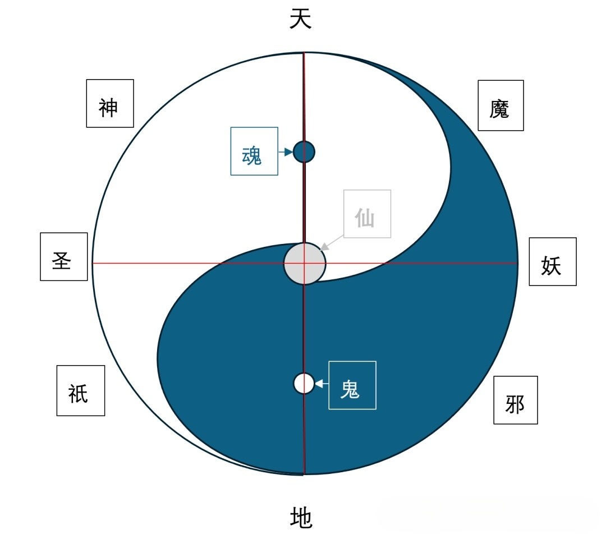

<h1 align='center'>太乙宇宙演化概论II——科技修真</h1>

## 修真与神灵之问

从修真角度而言，修真世界和神灵如何形成？修真世界形成了哪些结构？神灵包括了哪些类别？神灵之间有何关系，又如何相互演变？人与龙、凤分别代表哪些修真方向？人族与妖族有何渊源？修真与科技的关系如何？

之所以采用“神灵”这个概念来表述封神体系，是因为“神灵”一词本身并无褒贬之分，包括了光明和黑暗的不同位面。光明与黑暗的力量此消彼长，并非简单的取代关系。光明与黑暗相伴而生，相互制约，两者彼此覆盖，只在于明暗、显隐的区别。只是在同一周期内，能感受到阴与阳的交替。

从物质世界的观测角度而言，不同生灵视野中的可见光谱是不同的，因而看见的世界也不同。不同生灵向往的光明，是该族群认可的光明，这种光明对于其他族群而言，可能就属于黑暗。对于不同种族和文明而言，因为视野不同，利益和叙事角度的不同，对于神灵正反性认知也大为不同。本文试图采用统一的模型来探讨神灵体系，并揭示不同神灵类别间的联系。

## 神灵体系的结构

以经典太极阴阳鱼模型，绘制神灵体系的太乙宇宙模型。此图中红线仅起到界定坐标的作用。图分为上下两部分，代表天与地。图中心另有一个小圆圈，代表混沌。图也分为阴阳两部分，如以中心点和外圆圈的点作连线，则可见该点所具有的阴阳比率。在居中的至阳线和至阴线，分别有两个小圆圈，表达了“至阳一阴生，至阴一阳生”的道理。

</a>

<i>神灵层次结构图</i>

修真者不局限于人族，而是包括了各种生灵。神灵体系包括了神、魔、圣、妖、祇、邪、魂、鬼、仙等九种形态。其中神、魔、圣、妖、祇、邪、仙可视为修真可以达到的高阶形态。魂与鬼可视为修真失败后的低阶形态，但魂要高于鬼。祇可看成地神，邪可看成地魔。仙居于中心的混沌圈，代表修真的最高形态。修仙成功后，可以将混沌转化为阴阳，从而具有万千变化的神通。

该模型具有极强的对称性，神与邪、祇与魔、圣与妖、魂与鬼，都是阴阳的正反对照。从表面看，神、圣、祇具有光明的外表，但内心也有黑暗；魔、妖、邪具有黑暗的外表，但内心也有光明。站在不同种族的利益角度来看，光明与黑暗本就是相对而言的。此中天上之魂相对于光明而言，是黑色的；地下之鬼相对于黑暗而言，是白色的。所谓的鬼火，也就是不甘熄灭的生命之火。

修真的不同形态之间可以互相转化，相互的界限并不那么绝对。神可以为魔，魔可以为神。因在不同修真形态之间转换，就有了神圣、神祇、妖魔、妖邪、魔鬼、神魂、圣魂之说。光明与黑暗相伴而生，一念之间，可以向善，也可以作恶。人作为万灵之长，一般成圣，其他生灵则可以作妖。祇与邪掌管大地，对于黑暗中诞生的邪或魔，亦能封神，对黑暗更具震慑力。此模型具有自然演化的其他含义，可供进一步推演揣摩。

## 修仙世界的演化

此神灵体系的模型也可用来推演修仙世界的演化过程。《道德经》云“二生三”，是指阴阳二气冲气以和，其后则有“四时五行”的生成，如此再演化为多彩纷呈的自然世界。模型并非简单的二维图形，而是包括了折叠的时空。阴阳的融合，造就了宏大的时空，时空的运转符合易学之理；冲气也促成了各种细微的事物，再微小的事物包括阴阳之理，这是见微知著的道理。

从空间而言，天圆地方，四海包围着陆地；天上地下，天与地以山和海来交接。从时间而言，世界万物的演化都具有周期性，宇宙的演化从整体上要经历“成、住、坏、空”的过程；万物又有循环的小周期，无论是沧海桑田，还是朝生暮死，都在小周期中流转。在宇宙诞生之后，混沌先向外旋转，阴阳交替，如水波一样荡漾；宇宙膨胀到一定时期，则开始向内旋转，反向塌陷，万物复归于阴阳和混沌。

在[前文](./yuzhou_explain.md)论及[太乙宇宙的多维结构](./yuzhou_explain.md)时，把宇宙划分为诸界，包括起源属性的道界、混沌界、元神界，网络属性的谷神界、太虚界、流年界，星空中的神界、魔界、星魂界，天地相接处的昆仑界、仙界、洞天界、福地界，大地中的地祗界、圣界、妖界、凡尘界、幽冥界。此中太虚界也指梦界，凡尘界指人界，幽冥界也指鬼界。为与神灵体系相对应，增加与地祗界对应的邪界，指大地上具有黑暗属性的地神，也可称为地魔。

在盘古开天辟地之后，天地分开，阴阳交替轮转，五行凝聚，天上有了日月星辰，地上有了山川河流，这些也可视为大生命体（太乙宇宙中有时也称呼司命），控制大生命体的方法可以称为“神格天道”。生灵都可以成为修真者，通过获得神格天道来获得自然力量，并控制自然界。修真成功的生灵就进化成更高阶的形态，也就是所谓的神灵，包括了光明与黑暗的两面。

从宇宙演化的大周期而言，早期光明的力量占据了上风，神明辈出，这是神明的时代；后期黑暗的力量为主，妖魔横行，这是妖魔的时代，也是末法时代。从修真世界演化的周期而言，开始时混沌元气充足，可自由演化，各种生命形式层出不穷，相互之间没有隔离。修真比较容易成功，但因为本源种子的力量，人渐渐占据了上风。当混沌元气消耗到一定程度，元气浓度不够，自由演化就停止了，产生种族隔离，外观演化也因此停滞了。

如果要化形，需要额外的神通，而且化形的时间有限。凭借简单地汲取自然力量，修真是难以成功的。这就需要借助外物和工具的力量，这就是所谓的文明与科技。修真者可以通过炼丹等手段来凝聚混沌元气，达到逆向修仙的目的。还有另外一种可行的手段，就是在某个封闭的空间中来保证元气浓度，比如洞天福地等。

代表光明神性的神灵居于星空之上，形成了神界。代表黑暗属性的魔分布于暗星之中，形成了魔界。宇宙中心是最适合修仙之地，名为昆仑界。天地逆向融合也产生了混沌元气，成为仙界，天地分开时依然有部分通道，形成了洞天界和福地界。大地之上凡人居住之地为凡尘界，凡人修仙可先为圣人，于是有了圣界。异族生存于偏远和黑暗之地，于是有了妖界。

远古先民容易修真成功，但神话时代终究会过渡到英雄时代，以至于无名时代。遗存下来的远古记忆成为了梦界，在此界中依然会遵循元气自然演化的原则。在梦中的放纵超脱，其实只是早期的神话法则在起作用。英雄时代以后，万灵的回忆汇入银河之中，成为了流年界。因生命的轮回，上天之魂汇聚于鬼宿，成为星魂界；下地之鬼通过黄泉汇聚于幽都，成为了幽冥界。

## 人、龙、凤的象征

如以某种动物图腾来表达阴与阳的意象，龙与凤最为合适。从阴阳两仪向四时五行的演化过程中，起初以四凤来代表四面来风，以五龙来表现五色五行。河图洛书以五为中心，可代表黄河文明。四象八卦以四为基数，可代表长江文明。两种文明碰撞在一起后，最终形成了四象图腾，即青龙、朱雀、白虎、朱雀。但以阴阳而论，以龙代表阳，而以凤代表阴。

龙属水，凤属火，在五行之中，水、火与金、木、土不同，可视为能量流动的两种形式。火凤为朱雀居南方，水龙为玄武居北方，可见阴与阳亦是相对而言。从八卦的角度而言，离火卦为两阳包一阴，外表为阳，内部为阴，譬如太阳中有黑子，在神话中以金乌来代表。坎水卦为两阴包一阳，外表为阴，内部为阳，水看似柔弱却有极大的能量。火的能量看似发散的，内部却是收敛的；水的能量看似收敛，内部是发散的。在六十四卦中，水与火组成了既济与未济卦，可视为事物的终点与起点。

从修真角度来考量人、龙、凤的象征，可结合上述的神灵体系模型来分析。龙代表创生和原始力，凤代表延续和生命力，人代表智慧和精神力，这是修真进阶的三大方向。龙有天龙和水龙之分，如取乾卦意象，则为天龙；如取坎卦意象，则为水龙。凤有天凤和地凤之分，如取离卦意象，则为天凤；如取震卦意象，则为地凤。阴阳可转换，龙凤亦可。

天地有分星与分野的对应关系，这实际表明了天与地有一种伴生和镜像关系。星空四象中，南方为朱雀，朱雀为凤，朱雀之眼为鬼宿，这是阳中有阴。朱雀代表天火，而西北有地火，乃为烛龙，烛龙与朱雀是对偶关系。天上有银河，与地上的河流联通。玄武也可视为水龙，代表天水，地下有黄泉和幽都，由九凤镇守。九凤后来演化为九头鸟，俗称鬼车，与天上的鬼宿对应。玄武与九凤也可以看成对偶关系。对应中央星空的黄龙，地下亦有土伯，可视为一种地龙。

在盘古开天辟地的神话中，盘古从鸿蒙中诞生，具有龙的特征，但主要是人的身份。万灵都可视为龙、凤、人三类共同的后代。修真时如走“龙”的方向，则强调力量的强大，最终强行打破生命的枷锁；如走“凤”的方向，则强调生命的延续，凤会涅槃再生，从而生生不息；如走“人”的方向，则强调精神的纯真，最终达到混沌的状态，从而成仙得道。但从身体结构而言，人体最接近宇宙的结构，因而其他生灵往往需要先修炼获得人身，再踏上修仙之路。

## 人族与妖族的渊源

《山海经》中绘制的人物形象，很多都是人与动物的复合体，体现了远古图腾崇拜，不妨称为图腾形象。而在后来的神话传说或者《西游记》《封神演义》等作品中，这种复合体就称为“妖”了。广义上的妖，是除人族之外，由其他生灵进阶成的高级形态。这些生灵往往以动物为主，但也包括植物，乃至金、石、木、土等。典型的妖有九尾狐、孙悟空、牛魔王等。而早期具有动物图腾特征的则有蛇形的女娲、化熊的大禹等，不胜枚举。

这就产生了一个关于人与妖关系的疑问，为何《山海经》中称这些图腾形象为神或英雄？在后来的神话中为何又称为妖？人与妖定义的界限是什么？界限在何时产生？图腾崇拜在人与妖的关系中有何作用？在《山海经》刻画的神话人物中，其实已经包括了这种图腾形象的变迁，大致可以划分为神、神人、英雄三个阶段。随着人类文明的发展，图腾形象的神性减弱，而人性增强，文明则更加普及，脱离了矇昧的发展阶段。

下面结合模型来对人与妖的渊源进行神话学的推演。在宇宙诞生初始时，有代表阳的龙，代表阴的凤，以及居于中间代表灵性的人，三者一起演化为修真世界。在混沌元气充足的时候，万物自由演化，人与其他生灵之间也没有隔离，因而产生了融合众多生灵特征的图腾形象。盘古融合了龙、凤、人的三大始祖特征，而随后的天皇、地皇、人皇则传说为其他动物变化而来。

三皇时代后的神人时代呈现为丰富多彩的融合特征，这也是《山海经》中记载的众多奇特的图腾形象。但到伏羲、女娲乃至炎帝、黄帝时期，虽然有化形的传说，但这些主角无疑是作为人族而被铭记的。而后来大禹化熊的传说，则表明这种图腾形象其实已经只是一种精神烙印了，只有在“降神”或“狂化”的时候，英雄才能变身为图腾动物，从而暂时获得祖源之力。

天空中四象与二十八宿对应的动物形象，可视为图腾崇拜的记忆遗存。在大禹与九尾狐的爱情故事中，九尾狐还未被妖魔化，只是一个被边缘化的异族图腾而已。从修真世界的角度而言，是元气浓度下降导致了生灵间的生殖隔离，由此告别了图腾形象时代。但在父系传统取代母系传统，变为父传子的家天下制度时，国家文明的叙事方式则开始改写这些图腾形象的命运。

因为“天下之中”的概念，居中的国家文明以人族正统自居，而四周依然保持原始图腾崇拜的部族则称为异族，诸如“东夷、南蛮、西戎、北狄”的说法。由此人与妖的概念被界定起来，并产生了神话学上的对立。站在正统文明的角度而言，那些具备动物或其他生灵形象的图腾，就成了代表黑暗力量的妖魔，这也极大地改变了后来神话的叙事方式。庄生梦蝶的故事则表明，化形的体验只能在梦界获得，而不再是一种自然的本能了。

## 修真与科技的辩证

传统上看，修真与科技是两个不同的演化路线，修真强调对自身潜力的开发，而科技则强调外部工具的使用。而从本文对太乙宇宙的推演而言，这两者并不矛盾，甚至可以相互依赖。如果说龙代表了创生力量，凤代表了生命力量，人代表的灵性则必然会发展出智慧和文明，这也是人族凌驾于其他各族之上的根本原因。

在混沌元气充足的阶段，这种原始的力量能占据上风。但当混沌元气不再充足，生灵的自由演化停滞后，就进入了相对缓慢的进化阶段。文明凝聚了人类，群体能发挥出更大的创造了，人族征服自然，依靠的是强大的科技。工具的理性必然能战胜原始的矇昧。以龙族强大、凤族的坚韧，尚且屈服于刀剑和弓箭之下，更别论其他的飞禽走兽了。炼丹也可视为一种修真的科技手段。

在太乙宇宙的后续演化过程中，因为元气不断固化为物质，修真的大环境已经改变，不再适合开发身体潜能的原始修真方法。其实在神人时代，科技的力量已经彰显，伏羲与女娲所执的规矩，就意味着对世界的规划与变动。在涿鹿之战中，风后以指南车来帮助黄帝获得胜利。鲧用息壤治水失败，而大禹治水时，吸取鲧的教训，采取了疏导治水的正确方法。

人类站立行走，解放了双手，创造了工具，并利用工具进一步解放大脑，促成了文明的良性循环发展。虽然人的身体在很大程度上脱离了自然力量的控制，却凭借科技不断改造自身，可谓进入了科技修真的时代。以现代科技而言，通过基因编码提升生命层次，利用数字生命获得永生，模拟宇宙的演化，探索宇宙和神灵的本质，正是科技修真的具体表现。