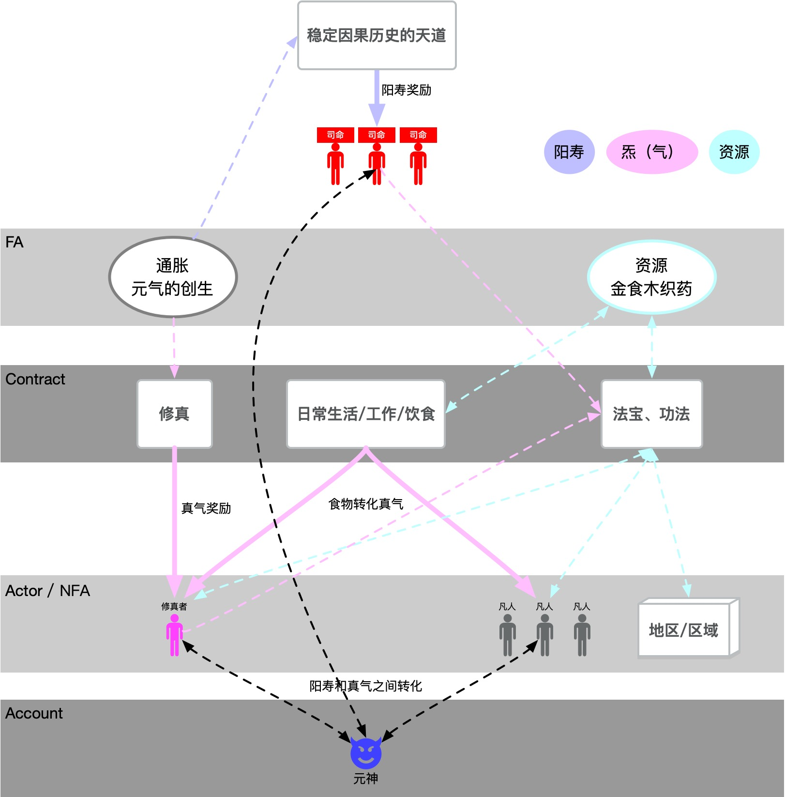
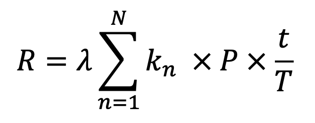

<h1 align='center'>元炁守恒</h1>

# 关于最开始的三界

据[内篇](yuzhou.md)（详解见[白话解读](yuzhou_explain.md)）所讲，宇宙最开始就有三个方面的力量在互相影响。

在太乙网络的具体实现中，`元神界`的本源意识相当于太乙网络中的账号（Account），这些账号可以是任意接入者，它们都能匿名地无准入地接入到网络中，对另外两界的对象进行交互。

而网络中所有的逻辑，包含硬编码到因果链中的C/C++逻辑和通过SGS智能合约编码的逻辑（Contract），都是属于`道界`的范畴。这些规则和对象都可以由账号来操作，正如内篇所述元神意识操作天道一样。

然而，元神意识操作天道（账号操作规则）的主要目的，则是使得各种物质能相互转化，进而促使宇宙创生万物并不断演化。这些演化的万物（NFA或者FA），统统来自`混沌界`最初的`元气（炁）`。元气（也称真气）中的部分转化成了万物，另外部分则在天道中流转。尽管混沌界中不断有元气创生，但现有的元气的总量，在转化或者流转过程中，始终在三界保持着恒定，无论是物质还是元气本身，它们都不能凭空消失，只能互相转化。

本文将尝试论述太乙网络上最初的一段时期，`道界`、`混沌界`和`元神界`这三界之间的相互关系和演化规律。

</a>

<i>天道、元气与物质</i>

## 元气

`元气`也叫做“真气”，在太乙网络中用符号“QI”来表示，被认为是一种同质化的资源（也称为同质化资产，简称FA）。

宇宙中元气可以转化创生出多种其他类型的同质化基础物质，形式上有`金石`（符号为GOLD）、`食物`（符号为FOOD）、`木材`（符号为WOOD）、`织物`（符号为FABRIC）和`药材`（符号为HERB）等等，这些物质和元气有一定的转换比率，比如500元气可以转化为100金石，反之亦然。

元气和基础物质可以进一步融合转化，被用于生产出万千事物来，这些事物被认为是非同质化的资源（也称为非同质化资产，简称NFA），诸如砂砾石子到日月星辰，又比如土地区域或者人神鬼怪。这些事物各自有自己的符号（Symbol），同时具体的事物对象都具有一定的物质量，也就是它自身内含的基础物质的数量值。因此，一个具体的事物，可以在数值上推算出它具有多少的气（QI）。通常，创建一个事物，是需要消耗等价的气或者物质的。

因而不管宇宙怎么演化，也不管物质怎么转化，当前整个宇宙的元气就具有一个形式上的总量，太乙网络上定义这个总量为“Supply”。这个形式总量包括了自由流转的真气、各种创生的物质和各种事物的等价真气量。

在混沌界，元气有个按年增长的速率，从经济学角度来讲叫年化增长率（APR）。这种真气的增长也称为真气通货膨胀，在我们现实时间二十年内，混沌界中元气总量（Supply）增长的速率按年从10%线性降低到1%（通胀率）。

创生出来的新的元气，百分之十被维护因果天道的司命们直接收获，而这百分之九十则游离于广阔宇宙万千世界，它们需要经由特殊的过程才能被捕获。这些特殊的过程，我们称之为“修真”。

关于时间，这里需要说明的是，目前模拟的大傩世界，现实时间的一小时相当于模拟大傩世界的一天，因此现实时间二十年将模拟大傩世界将近四百八十年。

## 阳寿

元气的物理数值精度较高，其量值可以表达到小数点后6位数。但是，考虑到元气的不稳定和易变特性，从维护最初天道“因果天道”的司命们开始，就直接将收获的元气凝聚转化为另外一种资源来保存，这种资源叫做“阳寿”。

`阳寿`，在太乙网络中用符号“YANG”来表示，也是一种同质化的资产，一般用作为对元气的计量等价物，因此通常是1比1的比率和元气互相转换。不同的是，阳寿量值的表达精度较低，仅为小数点后3位数。阳寿交换起来比较简单，目前了解到诸如坐忘道或者司天监这些门派机构，通常就是以阳寿作为通货来交换价值的。

## 真气的消耗

道界的规则要通过元气的激发来维持运转。因此，但凡元神要操作天道，就要消耗真气。世间万千事物要运动演化，它们内在天道的运转也要消耗真气。

这些消耗的真气不会凭空消失，通常会1比1转化为一种神奇的物质自行注入到设计创造这些天道的元神体内。这种物质叫做“非罡（feigang）”，大家通常把非罡作为各种天道运转的奖励来看待，因为非罡无法直接被使用，只有元神将非罡再炼化为真气，方才具有使用价值。

## 修真

在太乙网络中，`修真`这个过程是由一些底层操作来完成的。比如，`角色（Actor）`的内禀天道合约，就可以进行“开始修真”和“结束修真”这两个底层操作（详细示例可以参考[太乙天道实践二](https://github.com/hongzhongx/taiyi-contracts?tab=readme-ov-file#%E5%AE%9E%E8%B7%B5%E4%BA%8C%E5%88%9B%E5%BB%BA%E8%A7%92%E8%89%B2%E6%9D%8E%E7%81%AB%E6%97%BA%E5%B9%B6%E4%B8%94%E5%9C%A8%E7%89%9B%E5%BF%83%E6%9D%91%E5%87%BA%E7%94%9F)）。

将开始到结束修真的时间记为有效修真时间`t`，设最长修真时间`T`（例如24小时），要求`t<=T`。修真结束时，修真的发起者会获得一个概率性奖励元气，记为`R`。那么，R的计算公式可以表达为下式：

</a>

<i>修真获得的真气</i>

这里简单说明一下：
* R = 参与修真的真气 * P * t/T，这里`P`为结束修真时的确定性概率采样，其范围是[0,1.0]
* λ表示修真效率，由具体的功法决定
* NFA对象都具有一个属性“参与修真的真气k”，这个真气通常是由NFA体内自由真气在修真时被锁定产生的。不同修真功法可以选择多个参与NFA（participant），包括角色、法宝或者区域等等，他们在种类、数量以及参与的k值限制则由功法自身来定义
* 一旦开始修真，则会使得参与NFA的k>0。注意，当前k>0的NFA是不能参与新的修真的
* 修真功法有修真受益NFA（beneficiary），也就是创生的真气奖励的目标NFA，修真功法受益者可以涉及多个不同的NFA，包括角色、法宝或者区域等等。如果修真受益NFA自己的参与k为零，那么这个NFA可以同时参加多个修真活动
* 结束修真时，获得奖励的真气R经上图具体公式计算得出，在多个修真受益NFA的情况下，R的分配规则由各个功法自定
* 修真出来的真气不是凭空创建的，它们是来自真气通货膨胀对应的修真真气池（就是通胀的90%）
* 实际算法中，修真获得真气上限还和区域灵气浓度正相关，修真参与实体各自五行材料和区域五行相互的生克程度也会影响修真效率

## 物质和真气的相互转化

`金石`（符号为GOLD）、`食物`（符号为FOOD）、`木材`（符号为WOOD）、`织物`（符号为FABRIC）和`药材`（符号为HERB），这些基础物质可以和真气（符号为QI）之间进行相互转化，每种物质和真气之间的转化比率是不同的。

物质和真气的转化发生在各种情况。有的法宝自身可以把真气转化到物质，例如一种叫“[炼天塔](https://github.com/hongzhongx/taiyi-contracts?tab=readme-ov-file#%E7%82%BC%E5%A4%A9%E5%A1%94)”的法宝。有的法宝可以被安装到一个区域，然后转化出来的物质自动给予区域，在持续一定时间后（实际上是转化达到一定量的真气后），可以改变这个区域的整体属性，比如一种叫“[育田珠](https://github.com/hongzhongx/taiyi-contracts?tab=readme-ov-file#%E8%82%B2%E7%94%B0%E7%8F%A0)”的法宝可以将一个地区区域转化成农田。还有一些法宝，可以直接将真气转化为产物的物质量。

## 事物的物质量

NFA的`物质量`，这是指的NFA的内含物质，而不是NFA托管的资产。物质量是NFA本身的物质属性，包括含有金食木织药物质的等价数量。

在创建NFA时，如果需要投入资源来铸造，则相关资源转入NFA变成内含物质。某些铸造方法还可以直接投入真气，由真气转化为一些物质来转入NFA。反过来，炼化NFA也可以析出物质或者真气。

NFA参与修真的时候，本身的内含物质也可以作为等价的真气参与修真，这和特定修真功法有关系。

NFA本身是可以根据自身的物质量来推断出五行属性，比如内含物质以金石为主，则属金，以金石木材为主则金偏木或者木偏金。在大傩世界中，角色直接是具有五行属性的，诞生角色的时候，可以根据不同情况，对角色的NFA注入大量内含物质，以此来决定角色的五行。当然，一般要求内含等价真气要大于某个阈值，才能顺利诞生角色。

## 真气守恒

在真气总量不变的情况下，上述涉及物质转化或者真气交流的各种过程和环节，均要保持真气总量的恒定。司命们在维护因果天道的时候，一个重要的事务就是在每次产生因果变化的时候，都要核对各方面的物质、真气、阳寿和非罡的计量总量，要确保相关的计量组合相等，具体法则参考太乙网络核心代码。这些法则给太乙宇宙奠定了一个物理基础，即《真气守恒定律》。
